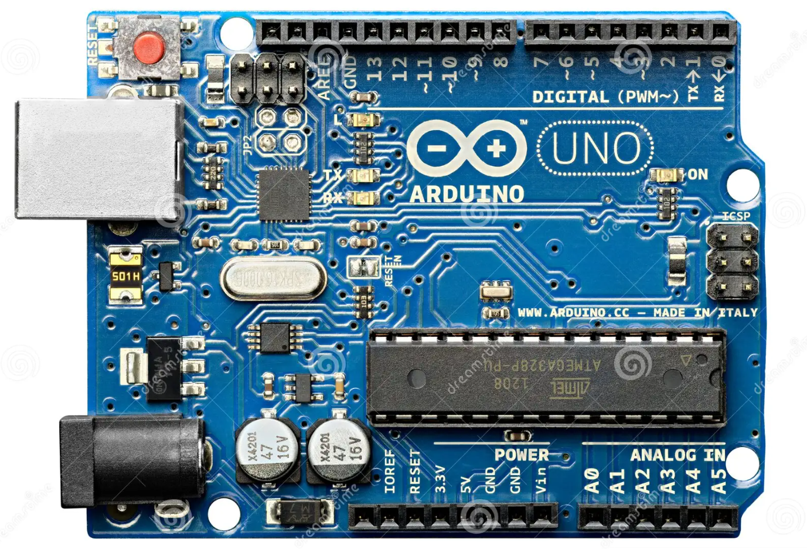
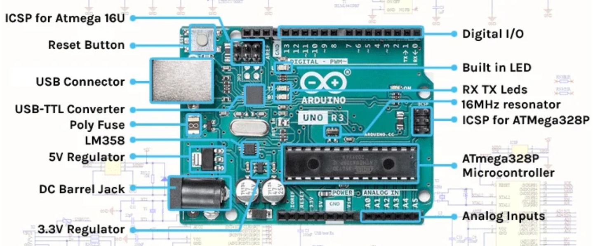
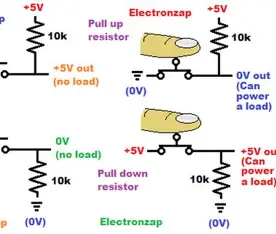
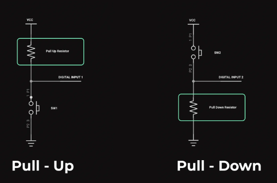

# What are Embedded Systems

An **embedded system** is a specialized computer system designed to perform a dedicated function within a larger mechanical or electronic system. It integrates both hardware and software components to achieve specific tasks, often with real-time computing constraints. Unlike general-purpose computers, embedded systems are optimized for particular applications, making them highly efficient and reliable.

> An **embedded system** is a **small computer inside a device** that does **one specific job**. It is not like your laptop or phone that can run many programs. Instead, it is built to **do one task very well**.
> 

## **Characteristics**

- **Task-specific**: It is designed to do **one job only**, not many different things.
- **Real-time operation**: It often must respond **very fast** and at the right time.

        Example: Airbag system in a car must react in milliseconds.

- **Resource-limited**: Optimized for low memory, low power, and minimal processing.

        It usually has:

- Small memory
- Low processing power
- Low power consumption
- **Reliability and Stability**: It must work for a long time with **very few errors**, especially in important systems like medical or automotive devices.

## **Where Do We Use Embedded Systems? (Applications)**

Embedded systems are **everywhere** around us:

### 🏠 Consumer Electronics

- Smartphones
- Smart TVs
- Washing machines
- Digital cameras

### 🚗 Automotive (Cars)

- Engine control system
- Airbag system
- Anti-lock braking system (ABS)

### 🏥 Medical Devices

- Pacemakers
- Insulin pumps
- Patient monitoring devices

### 🏭 Industry

- Robots in factories
- Sensors in machines
- Safety in medium voltage switch gears
- Process control systems

### 🌐 IoT (Internet of Things)

- Smart thermostats
- Home security systems
- Smart watches and wearables

## **Main Parts of an Embedded System**

An embedded system is usually made of:

### 1. Microcontroller / Microprocessor

This is the **brain** of the system.

It runs the program and controls everything.

A **microcontroller** usually has:

- CPU (processor)
- Memory
- Input/Output pins

 All in **one chip**

### 2. Memory

Used to store data and programs.

- **RAM** → Temporary memory (data while system is running)
- **ROM / Flash** → Stores the program (Code) permanently

### 3. Input and Output (I/O)

- **Inputs (Sensors)** → Get information from the environment
    
    Example: temperature sensor, light sensor
    
- **Outputs (Actuators/Displays)** → Show results or control something
    
    Example: motor, LED, screen
    

### 4. Software / Firmware

The program that tells the system what to do.

Usually written in:

- C
- C++

Sometimes uses a **Real-Time Operating System (RTOS)**.

### 5. Power & Communication

- **Power supply** → Battery or electricity
- **Communication modules** → To talk with other devices:
    - Wi-Fi
    - Bluetooth
    - Serial communication

# What are Microcontrollers, Microprocessors and Arduino

### Formal Definitions

**1) Microprocessor**

A **microprocessor** is a **programmable digital electronic component** that functions as the **Central Processing Unit (CPU)** of a computing system. It performs arithmetic, logical, and control operations by executing instructions stored in external memory. A microprocessor requires **external components** such as RAM, ROM, and input/output interfaces to form a complete working system.

**2) Microcontroller**

A **microcontroller** is a **compact integrated circuit (IC)** that contains a **CPU, memory (RAM and ROM/Flash), and peripheral interfaces** (such as I/O ports, timers, ADC, and communication modules) on a **single chip**. It is designed for **embedded applications** where it controls specific tasks within electronic systems.

**3) Arduino** 

**Arduino** is an **open-source electronics platform** based on **microcontroller development boards** and a **software development environment (Arduino IDE)**. It provides a hardware and software framework that simplifies programming and interfacing with microcontrollers for rapid prototyping, education, and embedded system development.

*👉🏼*Think of it like this:

| Thing | Like what in real life? |
| --- | --- |
| **Microprocessor** | Just a **brain** 🧠 |
| **Microcontroller** | A **small complete system** 🧠⚡📦 |
| **Arduino** | An **easy training kit** built around a microcontroller 🧰 |

## 1) Microprocessor

A **microprocessor** is **only the CPU (the brain)**.

It **cannot work alone**.

### It needs extra parts outside:

- Memory (RAM, ROM)
- Input/Output ports
- Timers
- Communication circuits

All of these must be connected **externally**.

### Used in:

- Laptops
- Desktop computers
- Powerful systems that need high speed

### Advantages

- Very powerful
- Can run complex operating systems (Windows, Linux)

### Disadvantages

- Uses more power
- Bigger system
- More expensive
- Not ideal for small simple devices

**Example:** Intel, AMD processors.

## 2) Microcontroller

A **microcontroller** is like a **mini computer on one chip**.

It has:

- CPU
- RAM
- Flash/ROM
- Input/Output pins
- Timers, ADC, communication modules

 **All inside ONE chip**

### Used in:

- Washing machines
- Cars
- Remote controls
- Medical devices
- Robots

### Advantages

- Cheap
- Small
- Low power
- Perfect for controlling hardware

### Disadvantages

- Less powerful than microprocessors
- Not made for heavy programs like games or big apps

 **Example:** ATmega, PIC, STM32.

## 3) Arduino

**Arduino is NOT a microcontroller.**

It is a **development board** that contains:

- A microcontroller (like ATmega328)
- USB connection
- Power circuit
- Programmer ( to transfer the code from to the microcontroller, and it is not a person 😊)
- Easy pins to connect sensors and motors

 It is made for **learning and prototyping**.

### 👉🏼Why Arduino is beginner-friendly:

- Simple programming (Arduino IDE, which is available on most of operating systems)
- Many ready libraries
- Easy hardware connections
- Open Source
- Huge online tutorials

### Used for:

- Learning embedded systems
- Student projects
- Fast prototypes

But in real products, engineers usually use the **microcontroller directly**, not the Arduino board.

## Summary

| Feature | Microprocessor | Microcontroller | Arduino |
| --- | --- | --- | --- |
| What is it? | CPU only | Full system on one chip | Board with a microcontroller |
| Needs external components? | Yes (a lot) | Very few | No (already ready) |
| Power consumption | High | Low | Low |
| Performance | Very high | Medium/Low | Same as its MCU |
| Used in | PCs, laptops | Embedded devices | Education & prototyping |
| Beginner friendly? | ❌ No | ⚠️ Medium | ✅ Very easy |

# Arduino UNO





## Datasheet

A **datasheet** is an official technical document provided by a component’s manufacturer that describes the **specifications, features, and operating conditions** of an electronic device. It serves as a primary reference for engineers, students, and designers to understand how a component works and how to use it correctly and safely in a circuit.

Datasheets contain detailed information about the **electrical characteristics**, **pin configurations**, **functional descriptions**, and **performance limits** of a device. They also include recommended operating conditions, timing diagrams, and example circuits. This information ensures that the component is used within its safe limits and performs as expected.

For beginners in electronics and embedded systems, learning to read a datasheet is an essential skill. It allows them to:

- Identify the purpose and capabilities of a component
- Understand how to connect it properly
- Avoid damaging the device by exceeding voltage, current, or temperature limits
- Write correct programs when dealing with programmable devices such as microcontrollers

👉🏼You Can Find The Datasheet here: [UNO R3 | Arduino Documentation](https://docs.arduino.cc/hardware/uno-rev3/)

We are interested in **Connector Pinouts.**

## Connector Pinouts

A **connector pinout** is a diagram or table that shows:

> What each pin on the board does.
> 

Every hole or metal pin on the Arduino board has a **specific function**.

The pinout tells us:

- Is this pin for **power**?
- Is it for **input** or **output**?
- Is it **analog** or **digital**?
- Does it belong to a **communication system** like I2C or SPI?

👉🏼From the datasheet, the connectors are divided mainly into: 

- **Analog connector (JANALOG)**
- **Digital connector (JDIGITAL)**
- **Power pins**


# How to Read a Pinout Table

In the datasheet pinout section, each row tells you: 

| Column | Meaning |
| --- | --- |
| **Pin name** | Label printed on board |
| **Function** | What the pin can do |
| **Type** | Power / Digital / Analog |
| **Description** | Extra details |

### 1) Power Pins

These pins provide **electric power** to your circuits.

| Pin | Meaning | What it does |
| --- | --- | --- |
| **5V** | 5 Volts | Supplies 5V power to sensors/modules |
| **3.3V** | 3.3 Volts | Supplies lower voltage devices |
| **GND** | Ground | The return path of current (must be connected) |
| **VIN** | Voltage Input | Used to power the board from external supply |
| **IOREF** | I/O Reference | Shows what voltage the board logic uses (5V here) |

👉🏼Always remember: **Every circuit must share GND.**

### 2) Analog Pins (A0 – A5)

These pins are used to read **analog signals** (not just 0 or 1).

| Pin | Use |
| --- | --- |
| **A0 – A3** | General analog inputs |
| **A4 (SDA)** | Analog + I2C data line |
| **A5 (SCL)** | Analog + I2C clock line |

**Analog signal = changing voltage**

Example: temperature sensor, light sensor.

The board converts analog voltage into digital numbers using an **ADC (Analog to Digital Converter)**. 

### 3) Digital Pins (D0 – D13)

These pins work with **digital signals**:

> Only two states → HIGH (1) or LOW (0)
> 

Used for:

- Turning LEDs ON/OFF
- Reading buttons
- Controlling motors

Some digital pins have **special jobs (**We will know more about those terminologies later):

| Pin | Special Function |
| --- | --- |
| **D0, D1** | Serial communication (TX/RX) |
| **D3, D5, D6, D9** | PWM (used for analog-like output) |
| **D10–D13** | SPI communication (SS, MOSI, MISO, SCK) |

### 4) Communication Pins

Some pins are used for devices to **talk to each other**:

We will know more about communication protocols later.

| Protocol | Pins | Use |
| --- | --- | --- |
| **I2C** | A4 (SDA), A5 (SCL) | Sensors, displays |
| **SPI** | D10–D13 | High-speed communication |
| **UART (Serial)** | D0, D1 | PC ↔ Arduino communication |

# ⚠️ Common Things Beginners Forget When Connecting a Board

## 1) Forgetting **GND**

Even if:

- You connected VCC
- You connected signal

 If **GND is not shared**, the circuit will **not work**.

## 2) Mixing Up **5V and 3.3V**

Some sensors/modules work at **3.3V only**.

If you connect them to **5V**, they may get **damaged permanently** 💀

**Check before connecting:**

- Module voltage rating
- Board output voltage

## 3) Powering the Board from Multiple Sources Incorrectly

Students sometimes connect:

- USB
- External VIN supply
- 5V pin

At the same time, without understanding.

This can cause:

- Overheating
- Regulator damage

**Rule:**

Use **one proper power method** unless you know what you're doing.

## 4) Reversing VCC and GND

Very common when using:

- Sensors
- Modules
- Breadboards

Connecting power backwards can:

- Destroy the module
- Damage Arduino pins

**Tip:** Always double-check labels:

- VCC / 5V / +
- GND / –

## 5) Using the Wrong Pin Type

Students connect devices to the wrong pins.

| Mistake | Problem |
| --- | --- |
| Analog sensor on digital-only logic | Wrong readings |
| Motor directly to pin | Pin burns (too much current) |
| Communication module on random pins | Doesn't work |

## 6) Ignoring Current Limits

Arduino pins can only supply **small current**.

Typical digital pin limit ≈ **20 mA**

Don’t power:

- Motors
- Relays
- Large LEDs
    
    directly from a pin.
    

Use:

- Transistor
- Driver module
- External power

## 7) Forgetting Input vs Output Mode

Pin must be configured in code.

Example:

```cpp
pinMode(7, OUTPUT);
```

If not:

- LED won’t turn on
- Button won’t read correctly

## 8) Loose Breadboard Connections

Sometimes nothing is wrong — just:

- Wire not fully inserted
- Wrong row in breadboard
- Broken jumper wire

## 9) Ignoring Voltage Limits on Pins

Arduino UNO pins usually tolerate **0–5V only**.

If you connect:

- 9V
- 12V
    
    directly to a pin → damage.
    

## 10) Not Checking Datasheet / Pinout

Students guess connections instead of checking:

- Which pin is SDA/SCL?
- Which pin is PWM?
- Which pin is GND?

Pinout is the **map**. Guessing causes errors.

# Clock frequency & Execution speed

## Clock Frequency

- **Clock frequency** is the speed at which the processor’s internal clock runs.
- It is measured in **Hertz (Hz)**:
    - 1 Hz = 1 cycle per second
- Every operation happens according to these clock ticks.
- The Arduino UNO uses the **ATmega328P** microcontroller. Its clock frequency is 16 MHz.

## Execution Speed

- **Execution speed** refers to **how fast the processor can execute instructions**. It depends on:
    - Clock frequency
    - Number of clock cycles required per instruction
    - Software functions used
- Not every instruction takes **1 cycle**.

$$
Instruction Time=Clock Cycles per Instruction / Clock Frequency
$$

### Effect of Common Arduino Functions

Some Arduino functions are **slow by design** to make programming easier.

### **3.1 `digitalWrite()`**

- Used to set a digital pin HIGH or LOW
- Easy to use but **relatively slow**
- Involves multiple internal checks before changing the pin state

**Effect on speed:**

- Takes **several microseconds**
- Not suitable for very fast signal generation

### **3.2 `analogRead()`**

- Reads an analog voltage using the **ADC**
- Requires time for analog-to-digital conversion

**Effect on speed:**

- Takes about **100 microseconds**
- Much slower than digital operations
- Limits how fast sensors can be sampled

### **3.3 `delay()`**

- Pauses program execution for a specified time
- Uses clock cycles while **doing nothing**

**Effect on speed:**

- Completely stops program execution
- Prevents multitasking
- Makes the system unresponsive during the delay

### Why This Matters in Embedded Systems

Execution speed affects:

| Application | Why speed matters |
| --- | --- |
| Sensors | Need fast reading |
| Motors | Precise timing |
| Communication | Correct data timing |
| Real-time systems | Must respond on time |

If clock is too slow:

- Delays increase
- System may fail timing requirements

# Digital I/O & Logic

## **1. Digital Pins**

Digital pins can work in **two modes**:

### **INPUT Mode**

The pin reads signals from external components.

- Used with: buttons, sensors, switches
- The pin detects:
    - **HIGH** → Logic 1 (usually 5V)
    - **LOW** → Logic 0 (0V)

```cpp
pinMode(2, INPUT);
```

### **OUTPUT Mode**

The pin sends signals to control components.

- Used with: LEDs, buzzers, relays

```cpp
pinMode(13, OUTPUT);
```

## **2. Digital Signal States**

| State | Meaning |
| --- | --- |
| **HIGH** | Voltage present (Logic 1) |
| **LOW** | No voltage (Logic 0) |

## **3. Basic Digital Functions**

| Function | Purpose |
| --- | --- |
| `pinMode(pin, mode)` | Sets pin as INPUT or OUTPUT |
| `digitalWrite(pin, value)` | Sends HIGH or LOW |
| `digitalRead(pin)` | Reads HIGH or LOW |

## **4. Push Buttons**

Buttons are digital input devices.

- Problem: When not pressed, the pin may read random values (**floating**).
- Solution: Use Resistors

### **Pull-up Resistor**

- Connects pin to **VCC**
- Default state = HIGH
- Button press → LOW

### **Pull-down Resistor**

- Connects pin to **GND**
- Default state = LOW
- Button press → HIGH





# Flashing a Code

**Flashing a code** refers to the process of **transferring and permanently storing a program** from a computer into a microcontroller’s **non-volatile memory** (Flash memory), so that the program can run automatically when the device is powered on.

When a code is flashed:

- The program is written into the microcontroller’s **Flash memory**
- The code remains stored even after power is turned off
- The microcontroller executes the program every time it resets or powers up

## **Flashing Code in Arduino**

In Arduino, flashing occurs when you press the **Upload** button in the Arduino IDE.

The process includes:

1. Compiling the code on the computer
2. Sending the compiled program through USB ( programmer )
3. Writing the program into the microcontroller’s Flash memory
4. Restarting the microcontroller to run the new code

## **Why It Is Called “Flashing”**

The term comes from **Flash memory**, which is a type of memory that:

- Can be erased
- Can be reprogrammed multiple times
- Retains data without power

So, “flashing” means **writing data into Flash memory**.

## **Important Notes**

- Flashing replaces the previous program
- The microcontroller does not need the computer after flashing
- Flash memory is different from RAM:
    - **Flash** → stores the program permanently
    - **RAM** → stores temporary data while running

# Arduino IDE: writing, compiling, uploading code

The **Arduino IDE (Integrated Development Environment)** is the software used to **write**, **compile**, and **upload** programs to an Arduino board.

It acts as the **bridge** between your computer and the microcontroller.

## Writing Code (Sketch)

An Arduino program is called a **Sketch**.

Every sketch has **two mandatory functions**:

```cpp
voidsetup() {
// Runs once when the board starts
}

voidloop() {
// Runs repeatedly forever
}
```

### `setup()`

- Runs **only once**
- Used to:
    - Set pin modes
    - Initialize communication (Serial, I2C, SPI)
    - Configure hardware

Example:

```cpp
voidsetup() {
pinMode(13, OUTPUT);
}
```

### `loop()`

- Runs **again and again**
- Contains the main logic of your program

Example:

```cpp
voidloop() {
digitalWrite(13, HIGH);
delay(1000);
digitalWrite(13, LOW);
delay(1000);
}
```

👉🏼This code makes the LED blink.

## Compiling Code

**Compiling** means: Converting your human-readable code into **machine code** that the microcontroller understands.

When you click **✔ Verify** in the Arduino IDE:

The IDE will:

1. Check for **syntax errors**
2. Convert Arduino code to C/C++
3. Compile it for the selected microcontroller
4. Generate a binary file

### If compilation fails:

You may see errors like:

- Missing semicolon `;`
- Wrong function name
- Undefined variable

👉🏼**Fix compilation errors before uploading.**

## Uploading (Flashing) Code

**Uploading** means: Sending the compiled program from your computer into the Arduino’s **Flash memory**.

When you click **⬆ Upload**:

The IDE:

1. Compiles the code (again)
2. Resets the Arduino
3. Sends the program via USB
4. Writes it into Flash memory
5. Restarts the board

After upload:

- The Arduino runs the program **automatically**
- The computer is no longer needed

## Board and Port Selection (Very Important)

Before compiling or uploading, you **must select**:

### Board Type

From:

```
Tools → Board
```

Example:

- Arduino Uno
- Arduino Nano
- Arduino Mega

⚠️ Wrong board = upload failure or wrong behavior.

### Port

From:

```
Tools → Port
```

- Select the COM port where the Arduino is connected
- If no port appears:
    - Check USB cable
    - Check drivers

## Common Arduino IDE Buttons

| Button | Function |
| --- | --- |
| ✔ Verify | Compile only |
| ⬆ Upload | Compile + Upload |
| 🗑 New | Create new sketch |
| 📂 Open | Open existing sketch |
| 🔍 Serial Monitor | View serial data |

## Serial Monitor (Basic Debugging Tool)

The **Serial Monitor** lets you:

- Print messages from Arduino
- See sensor values
- Debug logic errors

Example:

```cpp
voidsetup() {
  Serial.begin(9600);
}

voidloop() {
  Serial.println("Hello Arduino");
delay(1000);
}
```

Open it using:

```
Tools →Serial Monitor
```

⚠️ Baud rate must match (`9600` here).

## Typical Beginner Mistakes in Arduino IDE

- Forgetting to select the board → Upload fails
- Wrong COM port → “Board not found” error
- Syntax errors → Compilation fails
- Uploading while Serial Monitor is open → Port busy error
- Using wrong baud rate → Garbled serial data
