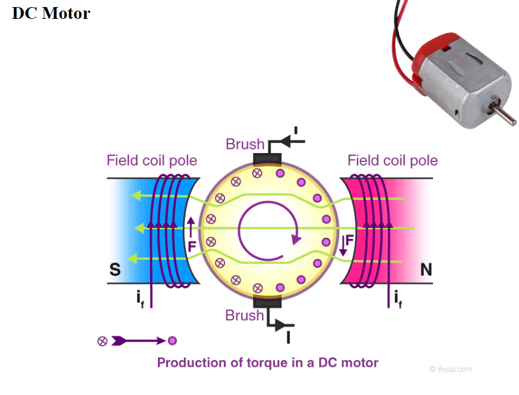
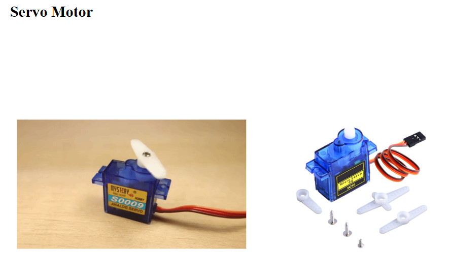
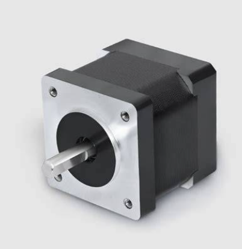
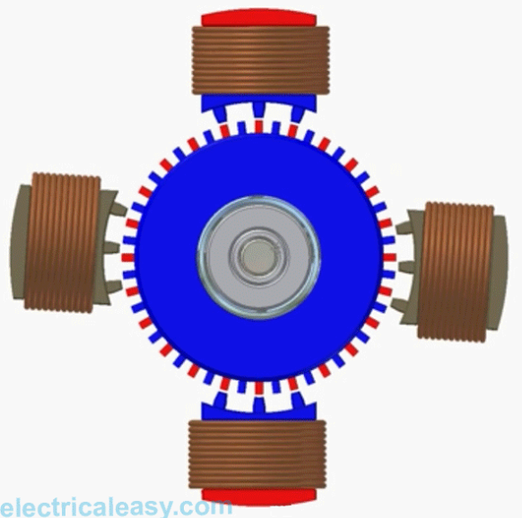
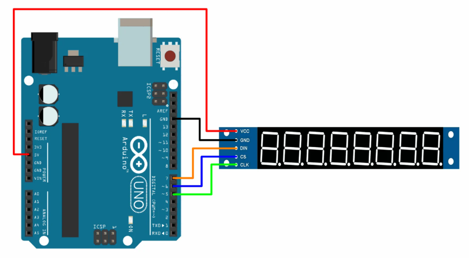
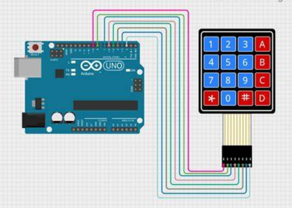
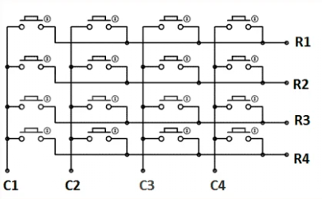
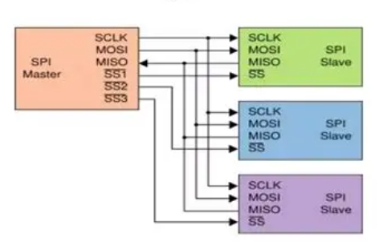
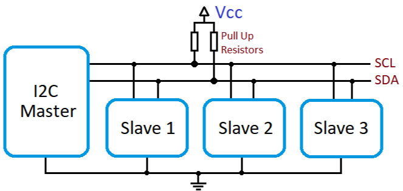

# Actuators

Unlike sensors (inputs), **actuators are output devices** that convert electrical signals into physical action such as motion, rotation, or display.

Examples in this session:

- Motors (DC, Servo, Stepper)
- Displays (7-segment)
- Keypads (user input for integrated systems)

---

# Motors

## 1) DC Motor

### Definition

A **DC motor** converts electrical energy into rotational motion.

It has:

- 2 terminals
- Rotates continuously when powered



### Speed Control Using PWM

PWM = **Pulse Width Modulation**

Instead of changing voltage physically, we:

- Turn signal ON and OFF very fast
- Control average voltage

Arduino function:

```arduino
analogWrite(pin,value);
```

- Value range: 0 → 255
- 0 = OFF
- 255 = Full speed

Example:

```arduino
analogWrite(9,128);// 50% speed
```

### Important Concept

- DC motors draw high current.
- Never connect directly to Arduino pin.
- Always use a motor driver (like L298N).

---

## 2) Servo Motor

### Definition

A **servo motor** is used for **precise position control**.

Typical range:

- 0° to 180°

Unlike DC motor:

- It does NOT rotate freely
- It moves to a specific angle



### How It Works

Servo uses:

- Internal motor
- Gear system
- Position feedback (control circuit)

### Using Servo Library

```arduino
#include<Servo.h>

Servo myServo;

void setup() {
myServo.attach(9);
}

void loop() {
myServo.write(90);// Move to 90 degrees
}
```

Why library?

- Generates correct control pulses automatically
- Simplifies timing complexity

---

## 3) Stepper Motor (Concept Only)

### Definition

A **stepper motor** moves in **fixed steps** instead of continuous rotation.

Example:

- 200 steps per revolution
- Each step = 1.8°





### Key Characteristics

- Very precise
- Used in:
  - 3D printers
  - CNC machines
  - Robotics

Unlike DC:

- Controlled by sequence of pulses
- Requires special driver

---

# Motor Driver – L298N (Basics)

## L298N

### Why We Need It

Arduino pins:

- Provide low current (~20–40 mA)

Motors require:

- High current
- Direction control

### What L298N Provides

- Controls 2 DC motors
- Direction control (IN1, IN2)
- Speed control (ENA using PWM)
- External motor power supply

### Direction Logic

| IN1  | IN2  | Direction |
| ---- | ---- | --------- |
| HIGH | LOW  | Forward   |
| LOW  | HIGH | Reverse   |
| LOW  | LOW  | Stop      |

---

# 7-Segment Display

A **7-segment display** is used to show digits (0–9).

It contains:

- 7 LEDs labeled a–g
- Optional decimal point



## Types

### 1) Common Cathode

- All cathodes connected to GND
- Segment ON → HIGH

### 2) Common Anode

- All anodes connected to VCC
- Segment ON → LOW

⚠️ Logic is reversed between the two types.

Below is the **binary truth table for digits (0–9)** for a standard **7-segment display**, for both:

- **Common Cathode (CC)** → Segment ON = `1`
- **Common Anode (CA)** → Segment ON = `0`

Assumption:

Segment order = **a b c d e f g**

```
      a
     ---
  f |   | b
     -g-
  e |   | c
     ---
      d
```

## Common Cathode (Segment ON = 1)

| Digit | a b c d e f g | Binary (abcdefg) |
| ----- | ------------- | ---------------- |
| 0     | 1 1 1 1 1 1 0 | 1111110          |
| 1     | 0 1 1 0 0 0 0 | 0110000          |
| 2     | 1 1 0 1 1 0 1 | 1101101          |
| 3     | 1 1 1 1 0 0 1 | 1111001          |
| 4     | 0 1 1 0 0 1 1 | 0110011          |
| 5     | 1 0 1 1 0 1 1 | 1011011          |
| 6     | 1 0 1 1 1 1 1 | 1011111          |
| 7     | 1 1 1 0 0 0 0 | 1110000          |
| 8     | 1 1 1 1 1 1 1 | 1111111          |
| 9     | 1 1 1 1 0 1 1 | 1111011          |

## Common Anode (Segment ON = 0)

This is simply the **inverse** of Common Cathode.

| Digit | a b c d e f g | Binary (abcdefg) |
| ----- | ------------- | ---------------- |
| 0     | 0 0 0 0 0 0 1 | 0000001          |
| 1     | 1 0 0 1 1 1 1 | 1001111          |
| 2     | 0 0 1 0 0 1 0 | 0010010          |
| 3     | 0 0 0 0 1 1 0 | 0000110          |
| 4     | 1 0 0 1 1 0 0 | 1001100          |
| 5     | 0 1 0 0 1 0 0 | 0100100          |
| 6     | 0 1 0 0 0 0 0 | 0100000          |
| 7     | 0 0 0 1 1 1 1 | 0001111          |
| 8     | 0 0 0 0 0 0 0 | 0000000          |
| 9     | 0 0 0 0 1 0 0 | 0000100          |

## Important Implementation Note

If using Arduino:

### Common Cathode

```arduino
digitalWrite(segmentPin,HIGH);// ON
```

### Common Anode

```arduino
digitalWrite(segmentPin,LOW);// ON
```

---

# Keypads (Concept + Usage)

A keypad is a **matrix of buttons** arranged in rows and columns.

Example: 4×4 keypad

- 4 rows
- 4 columns
- 16 keys





### Why Matrix?

Reduces number of pins required.

Instead of 16 pins:

- Use 8 pins (4 rows + 4 columns)

### Typical Usage

- Password systems
- Menu navigation
- User input control

Usually used with **Keypad library** to simplify scanning.

---

# Libraries – Why and When to Use Them

A **library** is pre-written code that performs complex tasks.

## Why Use Libraries?

- Saves development time
- Reduces errors
- Handles low-level hardware control
- Improves code readability

## When to Use?

Use a library when:

- Communication protocol is complex (I2C, SPI)
- Device timing is critical (Servo, DHT11)
- Device requires structured commands (LCD, Keypad)

Avoid libraries when:

- You want to understand low-level behavior
- Project is extremely simple

---

# System Integration Principles

Integration = combining multiple modules into one working system.

Example Final Project:

- Read keypad input
- Display number on 7-segment
- Control motor speed
- Use thresholds for safety

## Key Principles

### 1) Modularity

Use functions:

```arduino
readKeypad();
controlMotor();
updateDisplay();
```

### 2) Non-Blocking Design

Avoid excessive `delay()`.

Use:

- `millis()` timing
- State machines

### 3) Clear Data Flow

Input → Processing → Output

### 4) Power Management

Separate:

- Logic supply (5V)
- Motor supply (external)

---

# Advanced Overview

---

# SPI

## Serial Peripheral Interface

### Definition

SPI is a **synchronous communication protocol**.

Uses:

- MOSI
- MISO
- SCK (clock)
- SS (slave select)



### Characteristics

- Very fast
- Full duplex
- Master-slave architecture

Used for:

- SD cards
- Displays
- Sensors

---

# I2C

## Inter-Integrated Circuit

Also called:

- I squared C



### Uses Only 2 Wires

- SDA (data)
- SCL (clock)

### Features

- Multiple devices on same bus
- Each device has unique address
- Slower than SPI
- Very efficient wiring

Used for:

- LCD modules
- EEPROM
- RTC modules

---

# Debugging Techniques

Debugging = finding and fixing errors.

## Common Techniques

1. Use `Serial.println()` frequently
2. Print variable values
3. Check wiring carefully
4. Test modules individually before integration
5. Use LEDs as status indicators

## Structured Debugging Method

1. Verify power
2. Verify signals
3. Test small blocks
4. Integrate gradually

---

# Interrupts & ISR

### What Is an Interrupt?

An **interrupt** is a signal that temporarily stops the main program to execute a special function.

### Why Important?

Used for:

- Button press detection
- Real-time events
- Accurate timing

### ISR – Interrupt Service Routine

Special function that runs when interrupt occurs.

Example concept:

```arduino
void ISR_function() {
// runs automatically
}
```

⚠️ Rules:

- Keep ISR short
- Avoid delay()
- Avoid Serial printing inside ISR

---

# Common Integration Mistakes

1. Not using external power for motors
2. Mixing common anode/cathode logic
3. Blocking program with delay()
4. Forgetting to initialize libraries
5. Poor wiring organization
6. No modular design
7. Ignoring current limitations
